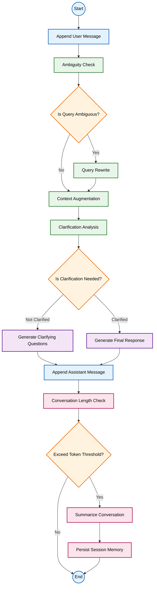
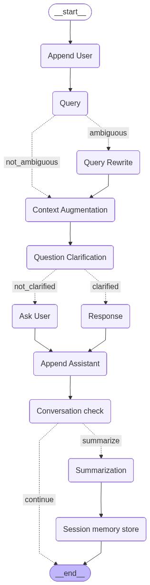

# Chat Assistant with Session Memory 


## 1. High-level Design

### 1.1. Overview

This system is implemented in LangGraph to model the conversation flow as a state machine.
Each user interaction is processed through structured stages:


| Step | Description |
|----- |------------ |
| 1 | Query Understanding |
| 2 | Clarification (if needed) |
| 3 | Response generation |
| 4 | Conversation memory management |
| 5 | Optional summarization and persistence |


The workflow ensures:
- Ambiguity detection
- Context-aware reasoning
- Controlled clarification loop (1–3 questions max)
- Session-level structured memory


### 1.2. System Pipeline




### 1.3. System Pipeline Explanation

#### i. Query Understanding Layer
- Detect ambiguity 
- Rewrite query if necessary
- Augment context using recent history and structured session summary
- Output: refined, context-complete query representation

#### ii. Response Control Layer
- Route execution based on clarification requirement
- Generate clarification questions (if needed)
- Otherwise produce final response
- Clarification handled across turns (no recursive loops)

#### iii. Memory Management Layer
- Append assistant output to history
- Evaluate token threshold
- Trigger structured summarization when exceeded
- Persist compact session memory


## 2. Setup Instructions

### 2.1. Requirements
- Python 3.10+
- pip
- (Optional) virtual environment

### 2.2. Clone Repository

```bash
git clone https://github.com/dducwsxuaan/chat-assistant-session-memory.git
cd chat-assistant-session-memory
```

### 2.3. Install Dependencies

```bash
pip install -r requirements.txt
```

### 2.4. API Key Configuration
This project does not store API keys in the Repository

Set your API key as an environment variable:

#### Windows (PowerShell)

```bash
$env:GROQ_API_KEY="your_api_key"
```

#### Mac / Linux

```bash
export GROQ_API_KEY="your_api_key"
```

## 3. Running demo

In this project, there are 2 versions for running the system: CLI and Streamlit UI

To test the system, you may find the test case in `test.txt`. Please use the value of key `Input` to test.

### 3.1. Run CLI version

```bash
python src/app.py
```
In the terminal, you will see:

```makefile
You: 
```
Type your query and interact with the assistant.

If you want to stop the conversation, type `exit` or `quit`.


### 3.2. Run Streamlit UI

```bash
streamlit run src/ui/streamlit_app.py
```

Then open:

```arduino
http://localhost:8501
```
Features:

- Chat interface

- Structured session memory

- Clarification loop

- Automatic summarization


### 3.3. Export Workflow Graph (Optional)

```bash
python scripts/export_graph.py
```

This generates:

```makefile
workflow_graph.png
```

The workflow graph is shown as below:

<div align="center">



</div>


## 4. Assumptions

- Each graph execution processes one conversational turn.

- Clarification loops are handled across turns, not recursively inside a single graph run.

- Session memory is summarized when token threshold is exceeded.

- The summarization model output strictly follows predefined JSON schema.

- No external vector database is used; memory is file-based.


## 5. Limitations

- Memory persistence is local file-based (not production-grade database).

- Summarization quality depends on LLM reliability.

- No advanced retrieval ranking mechanism.

- No retry logic for API failures.

- Token counting is approximate (based on tokenizer, not exact model usage).


## 6. Future Improvements (Optional but Strongly Recommended)
- Add vector-based semantic memory retrieval

- Add retry and failure handling

- Add user session IDs for multi-user support

- Add structured logging and monitoring

- Deploy with Docker + CI pipeline

- Add LangSmith tracing